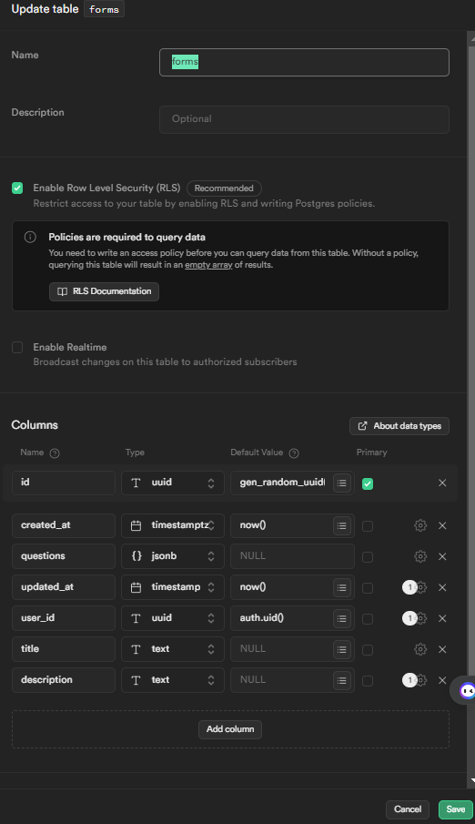

## Dynamic Form Generator

This is a simple dynamic form generator that allows you to create a form with set of feilds and then generate a form based on that set of feilds. The project is buit using Next.js , React, Typescript, TailwindCSS and Postgres (Supabase).

### Getting Started
We are using supabase as our database and you will need to create an account and a project to get the values for the environment variables. You can find more information about supabase [here]( https://supabase.com/),
The table structure for the project is as follows:




Before you can run the project you will need to create a `.env.local` file in the root directory of the project. This file should contain the following environment variables:
```
NEXT_PUBLIC_SUPABASE_URL = 
NEXT_PUBLIC_SUPABASE_ANON_KEY = 
```

Once you have created the `.env.local` file you can run the following commands to get the project running locally:

```
npm install
npm run dev
```